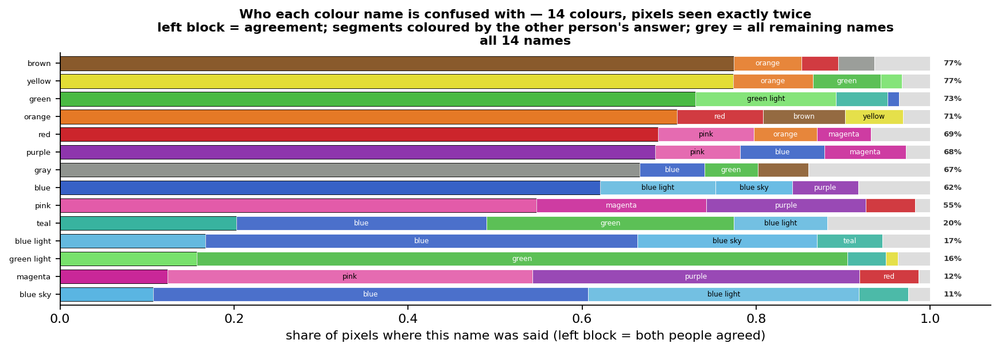
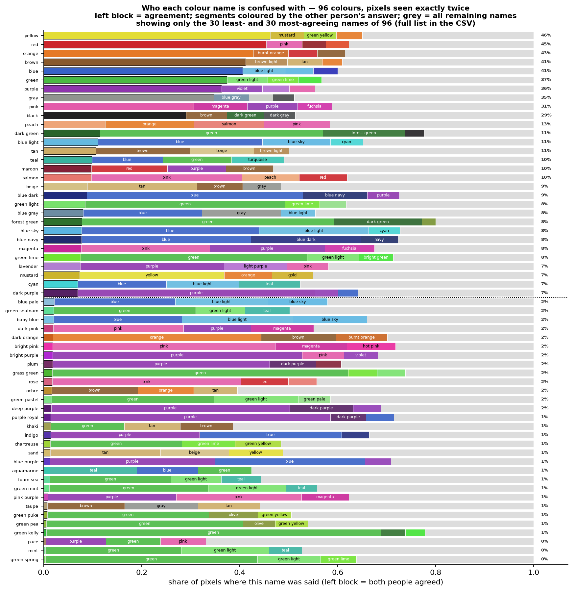
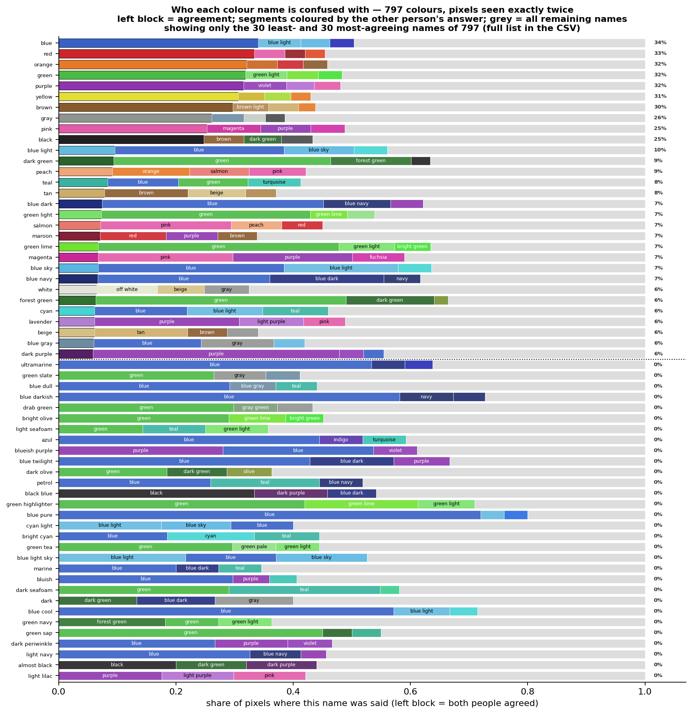
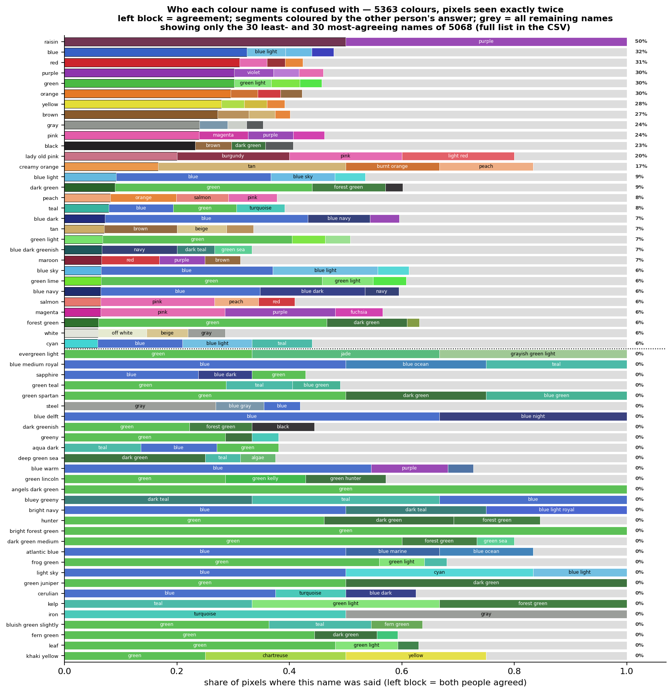

# Respondent disagreement on identical RGB values

How often two people shown the **identical pixel** give it the same name.

**Method.** Only pixels answered by exactly two people (one repetition) — ~95% of all
repeated pixels, which keeps every number on one population. A disagreement involves two
names, so instead of attributing it to one side we condition on each in turn: for name *c*,
take every pixel where someone said *c* and ask what the other person said. A pair (A,B)
counts once in A's row (as B) and once in B's row (as A).

## Dataset level

*agreement* = the two people gave the same name. *chance* = what two people would score
by ignoring the pixel and answering from name popularity alone. *kappa* (Cohen's kappa) is
agreement with those lucky matches removed: (agreement − chance) / (1 − chance);
0 = no better than guessing, 1 = perfect.

| labels | distinct RGB | seen exactly 2x | % of all RGB | disagree | agreement | chance | kappa |
|---|---|---|---|---|---|---|---|
| 14 | 1,402,278 | 67,095 | 4.8% | 27.9% | 0.721 | 0.133 | 0.68 |
| 96 | 2,235,900 | 151,762 | 6.8% | 65.5% | 0.345 | 0.054 | 0.31 |
| 797 | 2,626,125 | 205,808 | 7.8% | 75.0% | 0.250 | 0.037 | 0.22 |
| 5363 | 2,752,868 | 225,624 | 8.2% | 77.3% | 0.227 | 0.033 | 0.20 |

How often a pixel repeats at all (share of all distinct RGB values):

| labels | seen 2x | seen 3x | seen 4x | seen 5x |
|---|---|---|---|---|
| 14 | 67,095 (4.78%) | 2,485 (0.18%) | 65 (0.00%) | 3 (0.00%) |
| 96 | 151,762 (6.79%) | 7,540 (0.34%) | 271 (0.01%) | 7 (0.00%) |
| 797 | 205,808 (7.84%) | 11,740 (0.45%) | 499 (0.02%) | 13 (0.00%) |
| 5363 | 225,624 (8.20%) | 13,512 (0.49%) | 594 (0.02%) | 16 (0.00%) |

Pixels seen twice carry ~95% of all repeated pixels, which is why the per-class
analysis below rests on them. Agreement is a *lower bound* on the naming ceiling
(predicting the mode beats matching a random draw).

## Per-class level

**Reading the charts.** One bar per name = 100% of the pixels where that name was said.
The left block is agreement, coloured with the name's own average RGB; the next segments
are the three most common alternative answers, each in *its* own colour; grey is everything
else. Bars are sorted by agreement, with the percentage on the right.

**Files per colour count:** `agreement_<n>c.png` (chart), `agreement_per_class_<n>c.csv` (every name), `contested_pairs_<n>c.csv` (every pair).

### 14 colours

**Most agreed**

| name | pixels | agreement | mostly confused with |
|---|---|---|---|
| brown | 3,275 | 77% | orange (255) |
| yellow | 1,960 | 77% | orange (180) |
| green | 15,615 | 73% | green light (2523) |
| orange | 2,709 | 71% | red (268) |
| red | 3,705 | 69% | pink (409) |
| purple | 13,617 | 68% | pink (1335) |
| gray | 2,360 | 67% | blue (175) |
| blue | 17,495 | 62% | blue light (2321) |

**Least agreed**

| name | pixels | agreement | mostly confused with |
|---|---|---|---|
| blue sky | 3,097 | 11% | blue (1548) |
| magenta | 3,391 | 12% | pink (1422) |
| green light | 3,376 | 16% | green (2523) |
| blue light | 4,673 | 17% | blue (2321) |
| teal | 3,261 | 20% | blue (937) |
| pink | 7,281 | 55% | magenta (1422) |
| blue | 17,495 | 62% | blue light (2321) |
| gray | 2,360 | 67% | blue (175) |

**Most contested pairs**

| name A | name B | disagreements |
|---|---|---|
| green | green light | 2,523 |
| blue | blue light | 2,321 |
| blue | blue sky | 1,548 |
| magenta | pink | 1,422 |
| pink | purple | 1,335 |
| blue | purple | 1,321 |
| magenta | purple | 1,275 |
| blue light | blue sky | 964 |

### 96 colours

**Most agreed**

| name | pixels | agreement | mostly confused with |
|---|---|---|---|
| yellow | 3,226 | 46% | mustard (222) |
| red | 5,481 | 45% | pink (398) |
| orange | 4,341 | 43% | burnt orange (309) |
| brown | 5,922 | 41% | brown light (505) |
| blue | 25,906 | 41% | blue light (2238) |
| green | 29,151 | 37% | green light (2411) |
| purple | 24,380 | 36% | violet (2040) |
| gray | 4,382 | 35% | blue gray (315) |

**Least agreed**

| name | pixels | agreement | mostly confused with |
|---|---|---|---|
| green spring | 589 | 0% | green (255) |
| mint | 520 | 0% | green (144) |
| puce | 465 | 0% | purple (57) |
| green kelly | 718 | 1% | green (490) |
| green pea | 514 | 1% | green (206) |
| green puke | 540 | 1% | green (178) |
| taupe | 508 | 1% | brown (80) |
| pink purple | 477 | 1% | purple (125) |

**Most contested pairs**

| name A | name B | disagreements |
|---|---|---|
| green | green light | 2,411 |
| blue | blue light | 2,238 |
| purple | violet | 2,040 |
| green | green lime | 1,821 |
| blue | blue sky | 1,504 |
| bright green | green | 1,394 |
| magenta | pink | 1,363 |
| light purple | purple | 1,337 |

### 797 colours

**Most agreed**

| name | pixels | agreement | mostly confused with |
|---|---|---|---|
| blue | 30,302 | 34% | blue light (2193) |
| red | 7,284 | 33% | pink (378) |
| orange | 5,634 | 32% | burnt orange (297) |
| green | 33,676 | 32% | green light (2374) |
| purple | 27,628 | 32% | violet (2012) |
| yellow | 4,686 | 31% | mustard (211) |
| brown | 7,985 | 30% | brown light (488) |
| gray | 5,633 | 26% | blue gray (309) |

**Least agreed**

| name | pixels | agreement | mostly confused with |
|---|---|---|---|
| butter yellow | 36 | 0% | yellow (11) |
| camouflage green | 40 | 0% | green (10) |
| sepia | 47 | 0% | brown (18) |
| blue dark purple | 37 | 0% | purple (9) |
| bright lime | 29 | 0% | green (14) |
| aquamarine light | 25 | 0% | cyan (5) |
| blue faded | 77 | 0% | blue (32) |
| pale teal | 70 | 0% | blue (9) |

**Most contested pairs**

| name A | name B | disagreements |
|---|---|---|
| green | green light | 2,374 |
| blue | blue light | 2,193 |
| purple | violet | 2,012 |
| green | green lime | 1,797 |
| blue | blue sky | 1,485 |
| bright green | green | 1,378 |
| magenta | pink | 1,343 |
| light purple | purple | 1,310 |

### 5363 colours

**Most agreed**

| name | pixels | agreement | mostly confused with |
|---|---|---|---|
| raisin | 2 | 50% | purple (1) |
| blue | 31,650 | 32% | blue light (2180) |
| red | 7,747 | 31% | pink (375) |
| purple | 28,690 | 30% | violet (2002) |
| green | 35,377 | 30% | green light (2353) |
| orange | 6,035 | 30% | burnt orange (292) |
| yellow | 5,093 | 28% | green yellow (208) |
| brown | 8,618 | 27% | brown light (477) |

**Least agreed**

| name | pixels | agreement | mostly confused with |
|---|---|---|---|
| butter milk | 1 | 0% | light yellow (1) |
| coniferous green | 3 | 0% | dark green (1) |
| blueish grayish | 1 | 0% | blue ocean (1) |
| light pine | 3 | 0% | green (1) |
| despair | 3 | 0% | blue sky (1) |
| green matt | 7 | 0% | green (2) |
| green slightly yellow | 8 | 0% | green (3) |
| aqua muted | 2 | 0% | turquoise (1) |

**Most contested pairs**

| name A | name B | disagreements |
|---|---|---|
| green | green light | 2,353 |
| blue | blue light | 2,180 |
| purple | violet | 2,002 |
| green | green lime | 1,788 |
| blue | blue sky | 1,470 |
| bright green | green | 1,374 |
| magenta | pink | 1,340 |
| light purple | purple | 1,302 |
